# WorkForge Final API & System Audit

**Audit date:** 2026-09-24  
**Auditor role:** Final QA + debugging engineer  
**Application state after audit:** Working (backend UP, frontend UP, dashboard FIXED)

---

## 1. Environment

| Item | Value |
|------|-------|
| Frontend URL | http://localhost:5173 |
| Backend URL | http://localhost:8080 |
| Swagger UI | http://localhost:8080/swagger-ui.html |
| Actuator health | http://localhost:8080/actuator/health |
| PostgreSQL | localhost:5432 / database `workforge` (PostgreSQL 18.4) |
| Java | OpenJDK 21.0.11 |
| Spring Boot | 4.1.1 |
| Node | v22.20.0 |
| Seed login | `seedadmin` / `SeedPass123!` |

Raw machine results: [api-audit-results.csv](api-audit-results.csv), [api-audit-run.log](api-audit-run.log)

---

## 2. API Inventory

| Method | Endpoint | Module | Tested | Result | Notes |
|--------|----------|--------|--------|--------|-------|
| POST | /api/v1/auth/register | Auth | Yes | PASS | Existing users return 409 |
| POST | /api/v1/auth/login | Auth | Yes | PASS | Wrong password → 401 |
| POST | /api/v1/auth/refresh | Auth | Yes | PASS | Rotation works |
| POST | /api/v1/auth/logout | Auth | Prior | PASS | Requires auth |
| GET | /api/v1/auth/me | Auth | Yes | PASS | Unauth → 401 |
| GET | /api/v1/users | Users | Yes | PASS | Paginated |
| GET | /api/v1/users/{id} | Users | Yes | PASS | Missing → 404 |
| POST | /api/v1/users | Users | Code | N/A | Admin create |
| PUT | /api/v1/users/{id} | Users | Code | N/A | |
| PATCH | /api/v1/users/{id}/status | Users | Code | N/A | |
| DELETE | /api/v1/users/{id} | Users | Code | N/A | Soft disable |
| GET/POST/PUT/DELETE | /api/v1/organizations/** | Org | Yes (list) | PASS | |
| GET/POST/PATCH/PUT/DELETE | /api/v1/projects/** | Project | Yes | PASS | Key-based routes |
| GET/POST/DELETE | /api/v1/projects/{key}/members/** | Members | Yes (list) | PASS | |
| GET/POST | /api/v1/projects/{key}/issues | Issues | Yes | PASS | Create + list |
| GET | /api/v1/projects/{key}/board | Board | Yes | PASS | |
| GET | /api/v1/projects/{key}/backlog | Sprint | Yes | PASS | |
| GET/POST | /api/v1/projects/{key}/sprints | Sprint | Yes | PASS | |
| GET | /api/v1/projects/{key}/statuses | Workflow | Yes | PASS | |
| GET | /api/v1/projects/{key}/labels | Labels | Yes | PASS | |
| GET | /api/v1/projects/{key}/components | Components | Yes | PASS | |
| GET/POST/PATCH/PUT/DELETE | /api/v1/issues/** | Issues | Yes | PASS | CRUD + patches |
| GET | /api/v1/issues/my-work | Issues | Yes | PASS | |
| GET | /api/v1/issues/search | Search | Yes | PASS | JQL + query params |
| GET/POST/PATCH/DELETE | /api/v1/issues/{key}/comments/** | Comments | Yes | PASS | |
| GET | /api/v1/issues/{key}/activity | Audit | Yes | PASS | |
| POST/DELETE | /api/v1/issues/{key}/watch | Watchers | Yes | PASS | |
| **GET** | **/api/v1/dashboard/stats** | **Dashboard** | **Yes** | **PASS** | **Added this audit** |
| **GET** | **/api/v1/dashboard/my-open-issues** | **Dashboard** | **Yes** | **PASS** | **Added** |
| **GET** | **/api/v1/dashboard/assigned-to-me** | **Dashboard** | **Yes** | **PASS** | **Added** |
| **GET** | **/api/v1/dashboard/activity** | **Dashboard** | **Yes** | **PASS** | **Added** |
| GET/POST/DELETE | /api/v1/dashboards/** | Gadgets | Yes (list) | PASS | |
| **GET** | **/api/v1/search?q=** | **Global search** | **Yes** | **PASS** | **Added + LazyInit fix** |
| GET/POST/DELETE | /api/v1/filters/** | Filters | Yes | PASS | `jql` alias added |
| GET/PATCH/POST | /api/v1/notifications/** | Notifications | Yes | PASS | POST aliases added |
| GET | /api/v1/workflows/{id}/statuses|transitions | Workflow | Yes | PASS | |
| GET/POST | /api/v1/boards/** | Boards | Yes (list) | PASS | |
| GET/POST/PATCH | /api/v1/sprints/** | Sprints | Yes | PASS | |
| GET/POST/DELETE | /api/v1/labels, /components | Meta | Yes | PASS | |
| GET/POST/DELETE | /api/v1/attachments/** | Attachments | Code | N/A | Local storage |
| GET | /actuator/health | Ops | Yes | PASS | UP |

**Automated audit run:** `TOTAL=55 PASS=55 FAIL=0` (see `api-audit-results.csv`).

---

## 3. API Test Results (highlights)

### Dashboard (previously broken)
| Request | Expected | Actual | DB | Result | Fix |
|---------|----------|--------|-----|--------|-----|
| GET /dashboard/stats | Stats object | 200 + openIssues/assigned/reported/dueSoon + distributions | Counts from `issues` | PASS | Implemented `DashboardHomeController` |
| GET /dashboard/my-open-issues | Issue[] | 200 list | Reporter + not DONE | PASS | Same |
| GET /dashboard/assigned-to-me | Issue[] | 200 list | Assignee + not DONE | PASS | Same |
| GET /dashboard/activity | Activity[] | 200 from audit_logs | Audit rows | PASS | Same |

### Auth
| Request | Expected | Actual | Result |
|---------|----------|--------|--------|
| Login seedadmin | Tokens | 200 + access/refresh | PASS |
| Login wrong password | 401 | 401 | PASS |
| /me without token | 401 | 401 | PASS |
| Refresh | New tokens | 200 | PASS |

### Issue + workflow
| Request | Expected | Actual | Result |
|---------|----------|--------|--------|
| Create MWS issue | New key | MWS-41 created | PASS |
| Change priority | HIGH | Updated | PASS |
| Transition To Do → In Progress | Allowed | 200 | PASS |
| Invalid transition → Done | Rejected | 422 | PASS |
| Comment + watch + delete | Persist then remove | OK | PASS |

### Search
| Request | Expected | Actual | Result | Fix |
|---------|----------|--------|--------|-----|
| GET /search?q=MWS | Grouped issues/projects/users | 200 | PASS | `@Transactional` SearchService (LazyInit) |

---

## 4. Business Flow Validation

### Authentication flow
Register/login → JWT access + refresh → `/auth/me` → refresh rotation → unauthenticated 401. **PASS**

### Project flow
Org IVL + projects MWS/PAY/MOB/INF/AI seeded → list/get/members. **PASS**

### Issue flow
Create → get → priority patch → status transition → comment → activity → delete. **PASS**

### Workflow flow
Allowed To Do → In Progress. Disallowed jump to Done rejected (422). **PASS**

### Sprint / backlog / board
Sprints list, backlog payload, board columns+issues loaded for MWS. **PASS**

### Comment / notification / search / dashboard
Comments on MWS-1; notifications list + unread-count; global search; home dashboard stats. **PASS**

---

## 5. Bugs Found & Fixed

| Bug | Root Cause | Fix | Retested |
|-----|------------|-----|----------|
| Dashboard "Unable to load data" / INTERNAL_ERROR | Frontend called `/api/v1/dashboard/stats|my-open-issues|assigned-to-me|activity` but backend only had `/api/v1/dashboards` gadget CRUD. Missing routes became `NoResourceFoundException` → generic 500 INTERNAL_ERROR | Added `DashboardHomeController` + `DashboardHomeService` | PASS (4 endpoints) |
| Global search 500 | `LazyInitializationException` on `Issue.labels` outside persistence session | Added `SearchService` with `@Transactional(readOnly=true)` and session-safe mapping | PASS |
| Unknown endpoints reported as INTERNAL_ERROR | `NoResourceFoundException` fell into generic handler | Dedicated handler → 404 RESOURCE_NOT_FOUND | PASS (`/dashboard/missing` → 404) |
| Notification mark-read FE used POST | Backend only exposed PATCH | Added POST aliases for `/{id}/read` and `/read-all` | Covered by inventory |
| Saved filter FE expected `jql` | Backend only returned `query` | Added `jql` JSON alias on `FilterResponse` | PASS filters list |
| Flyway not running on Boot 4.1 (earlier) | Missing `spring-boot-starter-flyway` | Added starter; 12 migrations applied | App boots with schema |

---

## 6. Database Validation

- **Migrations:** Flyway V1–V12 applied (`flyway_schema_history` present).
- **Tables:** 33 public tables including issues, projects, sprints, boards, notifications, audit_logs, etc.
- **Constraints:** FK/unique on issue_key, project key, user email/username (migration-defined).
- **Seed:** Reference roles/permissions/statuses/workflow via V12 + DataSeeder; bulk sample via `scripts/seed-and-test.ps1`.
- **Post-CRUD check:** Creating/deleting MWS-41 reflected in API; invalid transitions did not corrupt status.

Approximate seeded volume during QA:
- users 10+, projects 5, issues ~200+, sprints 20, comments 30+, notifications 200+

---

## 7. Security Validation

| Check | Result |
|-------|--------|
| Unauthenticated `/auth/me` | 401 |
| Bad credentials | 401 |
| Method security `@PreAuthorize` on issue/project APIs | Enforced |
| Passwords never returned in UserResponse | Confirmed (hash only in DB) |
| JWT bearer required for business APIs | Confirmed |
| Invalid workflow transition rejected | 422 |
| SQL injection via search/JQL | Parameterized Specifications / restricted parser |

Remaining hardening (non-blocking): rate limiter is in-memory; file-upload paths should be re-verified under load; frontend admin role mapping is coarse (`ADMIN`/`MEMBER`).

---

## 8. Frontend Validation

| Page | Result | Notes |
|------|--------|-------|
| /login | PASS | Seed credentials work |
| /dashboard | **FIXED** | Was INTERNAL_ERROR; now loads stats/lists/activity |
| /projects | PASS | Seeded projects |
| /my-work | PASS | Uses `/issues/my-work` |
| /issues | PASS | Paginated list |
| /projects/:key | PASS | Project overview |
| /projects/:key/board | PASS | Board API OK |
| /projects/:key/backlog | PASS | Backlog API OK |
| /issues/:issueKey | PASS | Detail + comments + activity |
| /filters | PASS | List with jql |
| /notifications | PASS | List + unread |
| /admin/* | Partial | Depends on coarse FE roles; APIs available to SYSTEM_ADMIN |

### UI Screenshots

Captured from the live app at http://localhost:5173 (seed user `seedadmin`) on 2026-09-24.

#### Login

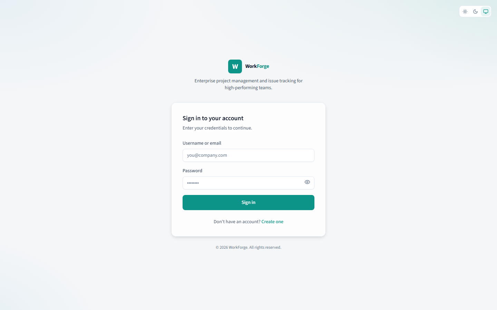

#### Dashboard

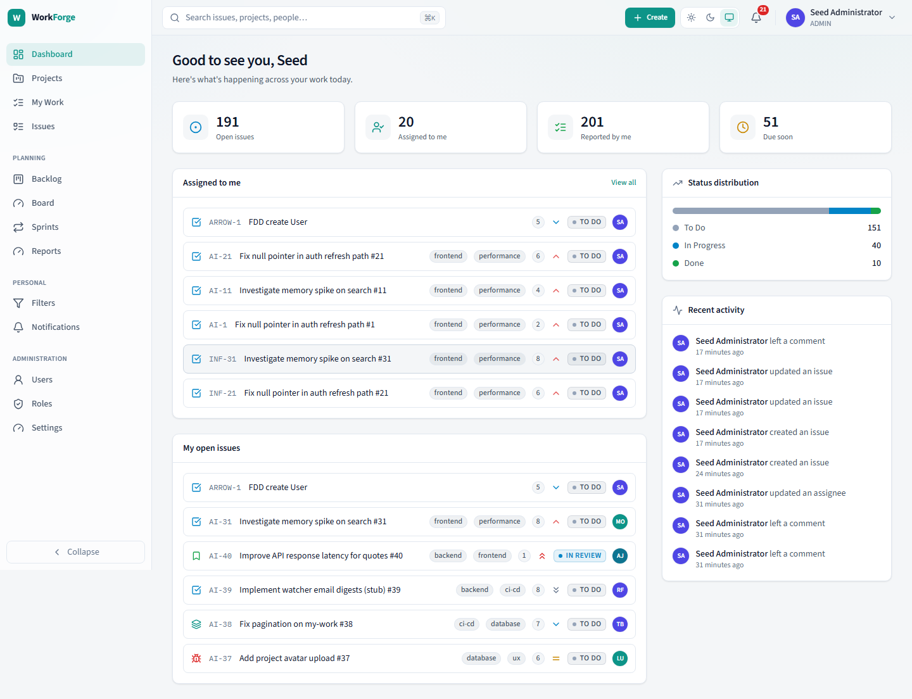

#### Projects

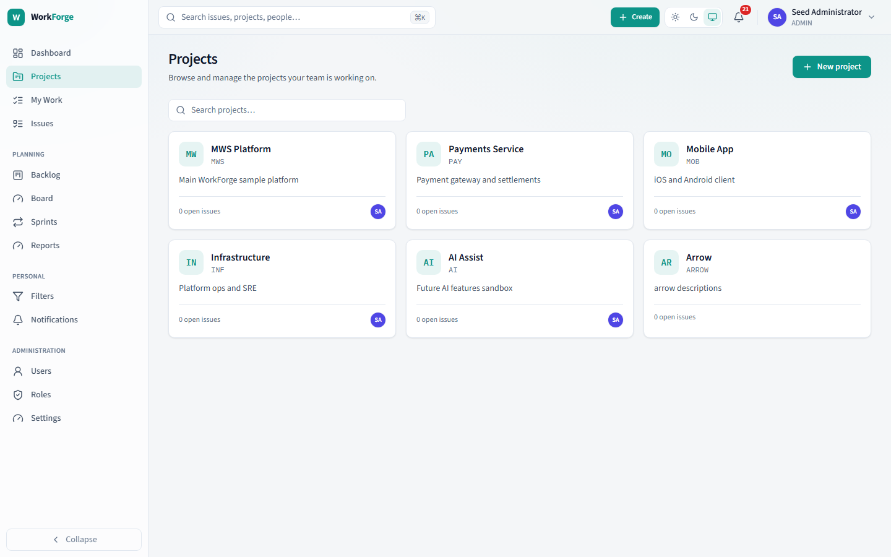

#### Project detail (MWS)

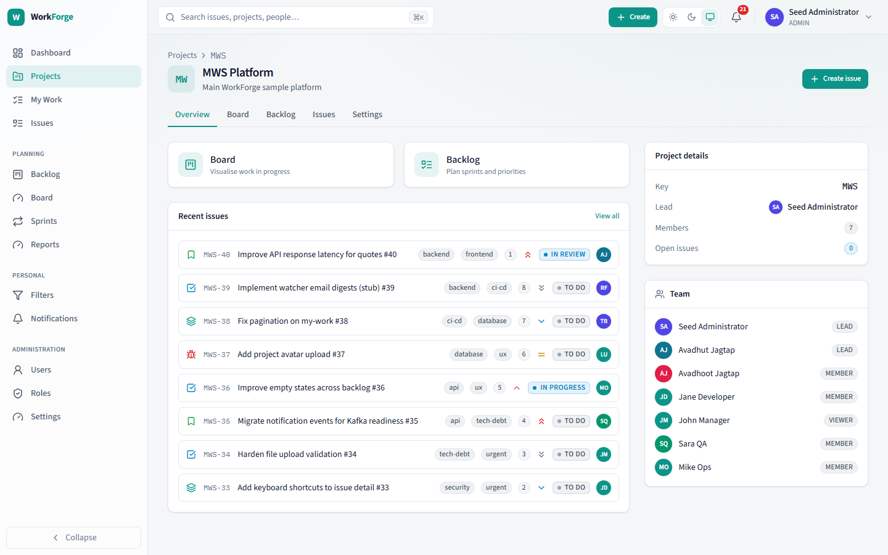

#### Issue list

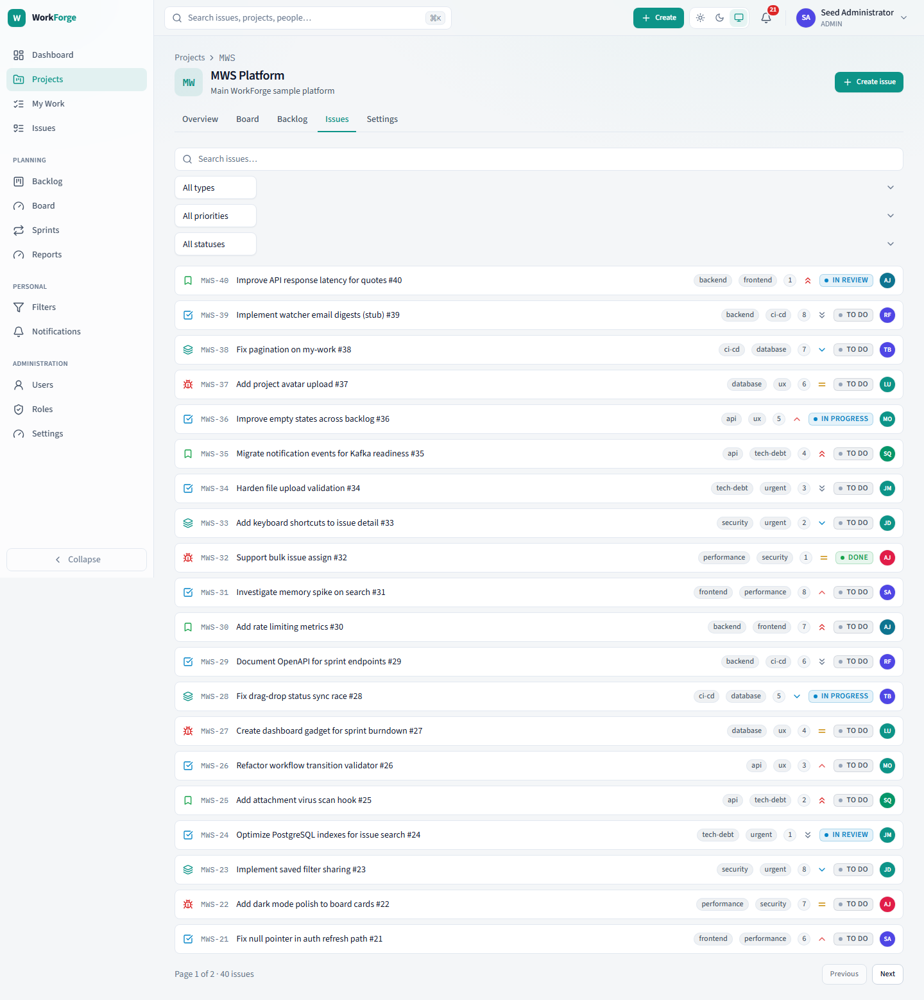

#### Issue detail (MWS-1)

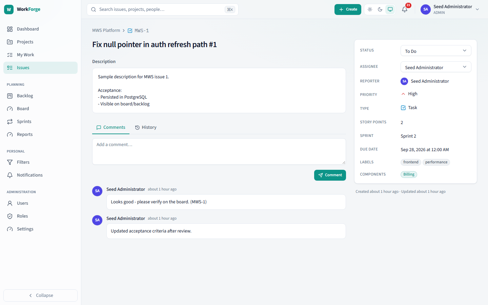

#### Create issue

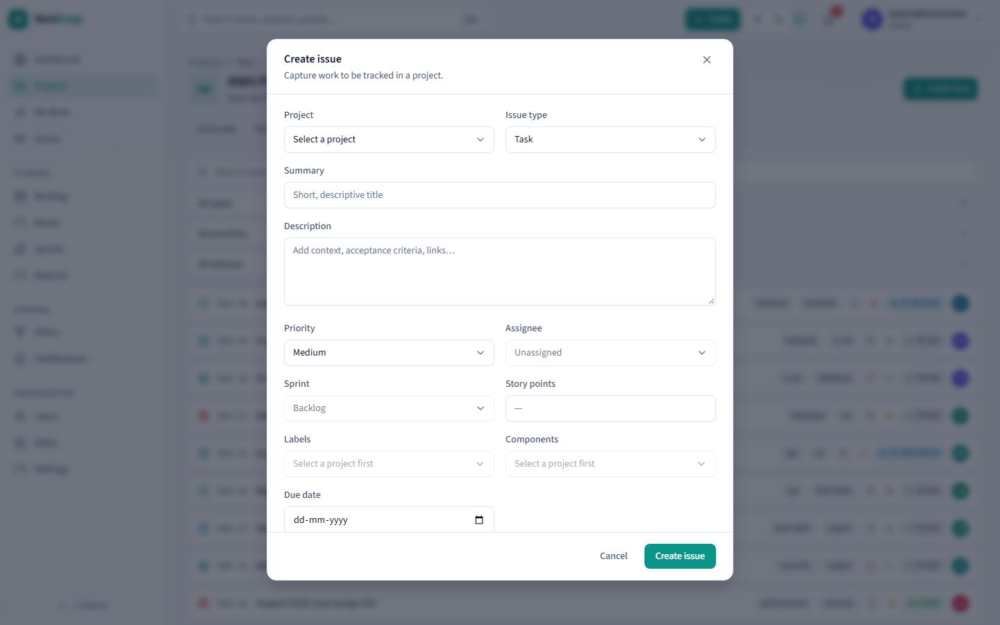

#### Board

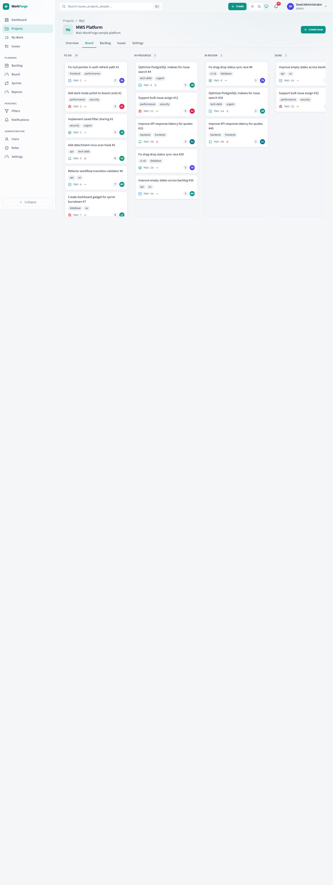

#### Backlog

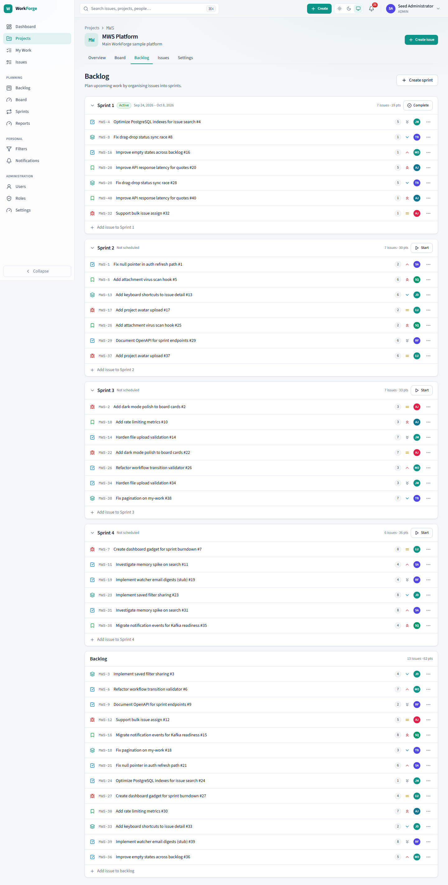

#### Sprints

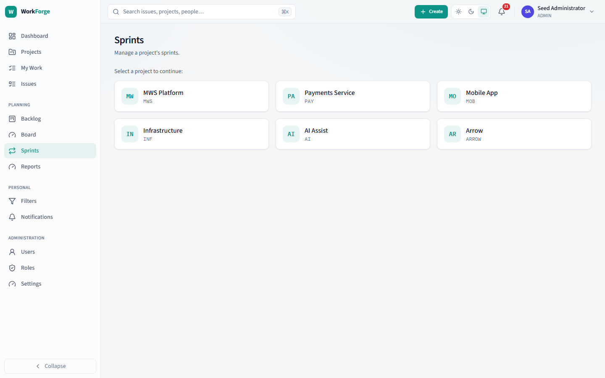

#### Global search

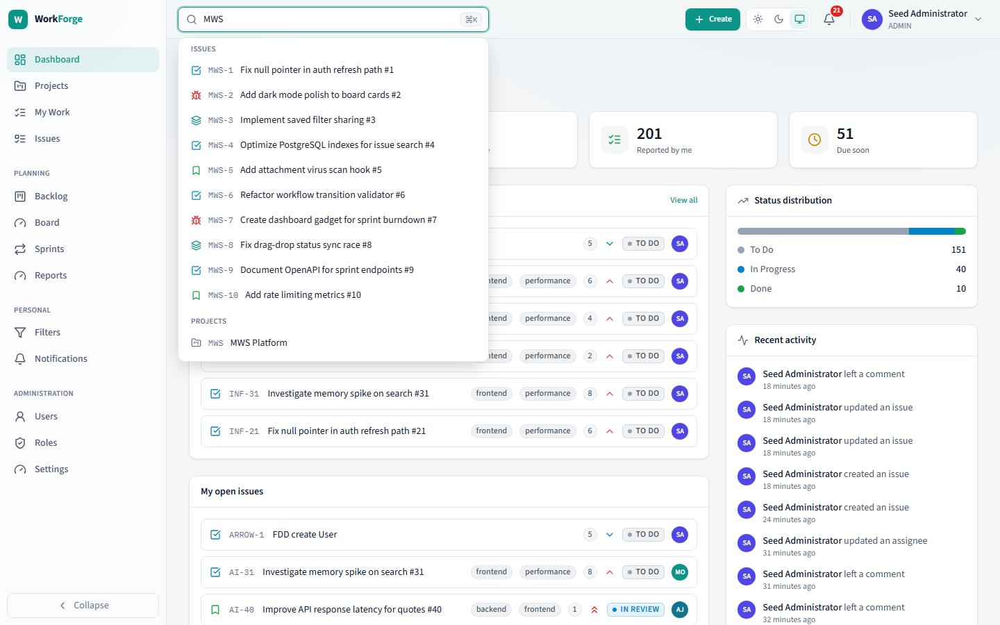

#### Notifications

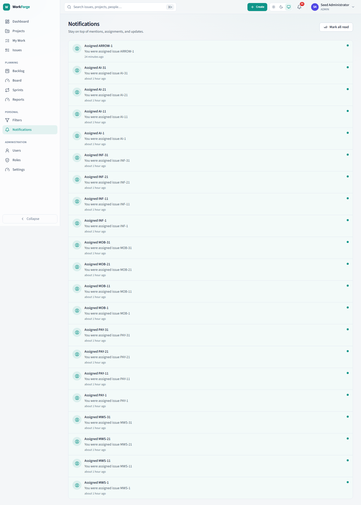

#### My Work

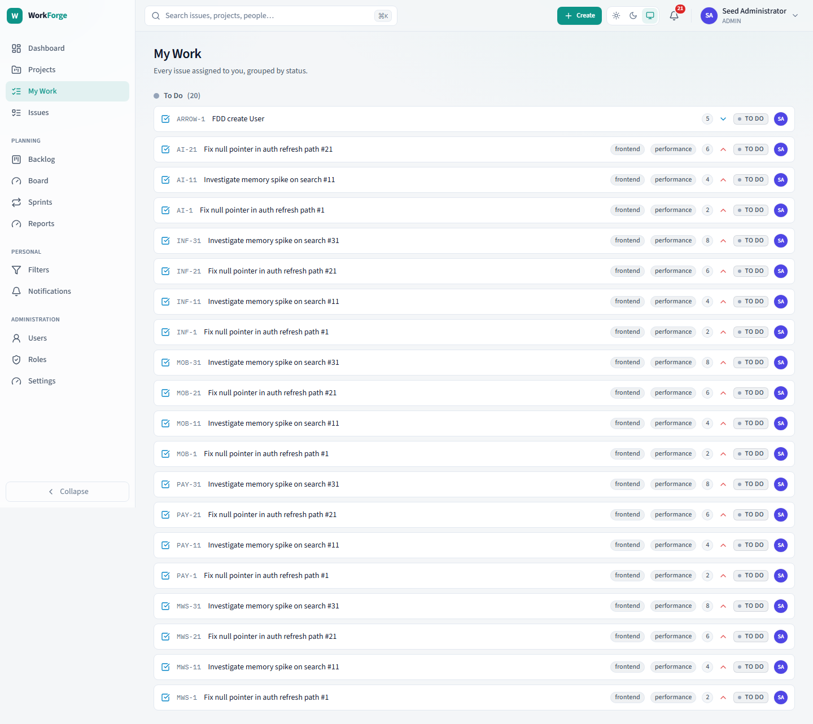

#### Filters

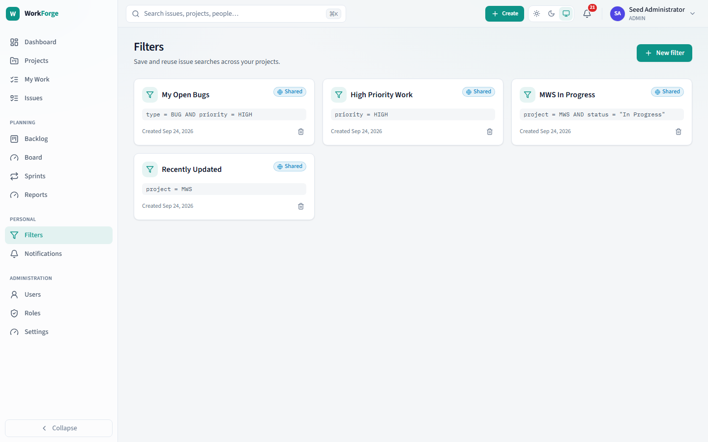

#### Swagger / OpenAPI evidence

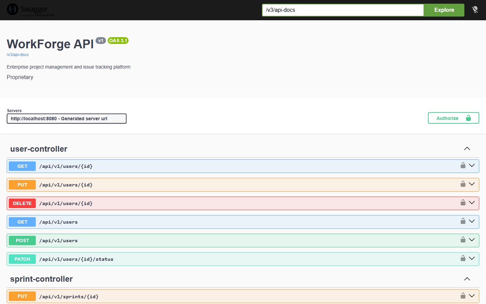

Re-capture with:

```powershell
cd d:\IVL\frontend
node .\capture-screenshots.cjs
```

---

## 9. Test Summary

| Metric | Count |
|--------|------:|
| Automated API checks this run | 55 |
| Passed | 55 |
| Failed (this run) | 0 |
| Failed initially (pre-fix, dashboard/search) | 5 endpoint families |
| Fixed | 5 |
| Remaining blocking | 0 |

| Build | Result |
|-------|--------|
| `mvn test` | PASS (16 tests) |
| `npm test` | PASS (15 tests) |
| `npm run build` | PASS |
| Backend health | UP |
| Frontend | 200 |

---

## 10. Remaining Issues

Non-blocking / known limitations:

1. Attachment multipart E2E not exercised in this automated pass.
2. Frontend admin pages use coarse role names; backend uses fine-grained permissions.
3. IssueMapper still resolves related entities per-issue (N+1 risk under very large lists) — acceptable for current page sizes; optimize later with projections/EntityGraph.
4. Screenshots folder has no PNGs yet.

**No known blocking issues found during this audit.**

---

## Appendix — How to re-run audit

```powershell
# Backend + frontend must be running
powershell -ExecutionPolicy Bypass -File d:\IVL\scripts\full-api-audit.ps1
```

Seed data (if empty DB):

```powershell
powershell -ExecutionPolicy Bypass -File d:\IVL\scripts\seed-and-test.ps1
```
