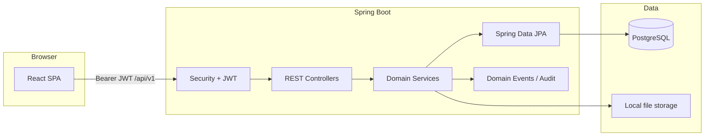

# WorkForge architecture

WorkForge is a modular monolith: one deployable Spring Boot application with clear package boundaries, plus a separate React SPA. Package root: `com.avadhoot.workforge`.

## High-level diagram

## Frontend

- **Stack**: React 18, TypeScript, Vite, TanStack Query, Zustand, React Router, Tailwind.
- **API access**: Axios client (`frontend/src/api/client.ts`) with automatic bearer token attachment and refresh on 401.
- **Routing**: Public auth routes (`Login`, `Register`); protected app shell with project-scoped views (issues, board, backlog, sprints, filters, notifications, admin).
- **Dev proxy**: Vite forwards `/api` to `http://localhost:8080` so the SPA can use relative `VITE_API_BASE_URL=/api/v1`.

The UI is a consumer of the REST API only; it does not embed business rules beyond presentation and client-side validation (Zod).

## Backend

- **Framework**: Spring Boot 4.1.1, Java 21.
- **Layers**: Controllers → services → repositories (JPA entities). DTOs and MapStruct mappers isolate API shapes from persistence.
- **Cross-cutting**:
  - `ApiResponse` envelope for success and error payloads
  - `GlobalExceptionHandler` maps exceptions to HTTP status + `ErrorResponse` in `data`
  - JWT filter + method-level `@PreAuthorize` for authorization
  - Rate limiting filter (token bucket from `workforge.ratelimit.*`)
  - JPA auditing (`created_at`, `updated_at`, optimistic locking via `version`)
  - Async domain event listeners for notifications and audit

## Database

- **PostgreSQL** with **Flyway** migrations (`V1`–`V12`).
- Hibernate `ddl-auto: validate` in dev — no auto DDL in production paths.
- Per-project issue numbering via `project_issue_seq` and pessimistic locking (`IssueSequenceService`).

See [database.md](database.md).

## Authentication

- **Registration** and **login** issue JWT **access** and **refresh** tokens.
- Refresh tokens are stored hashed in `refresh_tokens`; logout revokes the current session’s refresh token.
- **Public endpoints**: register, login, refresh, Swagger, actuator health/info.
- **Session model**: Stateless; no server-side HTTP session.

JWT claims carry user identity; authorities are permission names (e.g. `ISSUE_READ`) derived from roles.

## Authorization (authz)

- **RBAC**: `roles` ↔ `permissions` ↔ `user_roles`.
- **Roles** (seeded): `SYSTEM_ADMIN`, `ORG_ADMIN`, `PROJECT_ADMIN`, `PROJECT_MANAGER`, `DEVELOPER`, `REPORTER`, `VIEWER`.
- **Permissions** are fine-grained (`PermissionName` enum): user/org/project/issue/comment/sprint/board/workflow/filter/dashboard operations.
- **Project membership**: `project_members` with project-level roles; combined with global permissions for API access.
- Enforcement: Spring Security `@PreAuthorize("hasAuthority('…')")` on mutating or sensitive read endpoints.

## Issue lifecycle

1. **Create**: Validates project, type, priority, initial workflow status; allocates key `{PROJECT_KEY}-{n}` via sequence service; publishes creation event.
2. **Update**: Field updates with optimistic locking; audit/notification hooks on meaningful changes.
3. **Transition**: Status change validated against `workflow_transitions` for the project’s workflow.
4. **Assign / priority / sprint**: Dedicated patch operations on `IssueController`.
5. **Subtasks**: Issues with `parent_id` pointing to a parent issue.
6. **Labels & components**: Many-to-many via join tables (V6/V7).
7. **Watchers**: Users can watch issues for future notification use.
8. **Delete**: Soft or hard disable patterns vary by entity; issues support delete with permission checks.

Comments and attachments hang off the issue aggregate; file bytes live under `FILE_STORAGE_LOCATION`.

## Workflow engine

- **Workflows** define an ordered set of **statuses** and allowed **transitions** (named edges between status IDs).
- Projects reference a `workflow_id`; default workflow is seeded at startup (`DataSeeder`).
- **Read API**: list statuses and available transitions from a given status (`WorkflowController`).
- **Apply transition**: Issue service validates the edge exists, then updates `status_id`.

This is a configurable state machine, not a BPMN engine.

## Search

- **Endpoint**: `GET /api/v1/issues/search?jql=…` with Spring `Pageable`.
- **Implementation**: Restricted JQL-like grammar parsed into JPA `Specification` (`IssueQueryParser`) — whitelisted fields only, parameterized values (no raw SQL injection).
- **Supported fields**: `project`, `status`, `priority`, `type`, `assignee`, `reporter`, `sprint`, `summary`; operators `=`, `!=`, `~`; clauses joined with `AND`.
- **Saved filters**: Users persist query strings in `saved_filters` and execute via `FilterController`.

## Notifications

- **In-app** rows in `notifications` (type, title, message, entity reference, read flag).
- **API**: paginated list, unread count, mark one read, mark all read.
- **Production path**: `DomainEventListener` reacts to issue/comment events and creates notification rows asynchronously.
- Email (`spring-boot-starter-mail`) is on the classpath for future outbound delivery; primary UX is in-app.

## Audit

- **Table**: `audit_logs` (entity type/id, action, actor, details JSON/text, timestamp).
- **Writer**: `AuditService` invoked from domain event listeners alongside notifications.
- Complements JPA `created_by` / `updated_by` on auditable entities.

## Boards and sprints

- **Sprints**: CRUD, start/complete, list issues in sprint, project backlog (issues without sprint).
- **Boards**: Kanban columns mapped to workflow statuses; board view aggregates issues by column for drag-and-drop UI (`@dnd-kit` on frontend).

## Future AI extensibility

WorkForge intentionally keeps **no AI/LLM dependencies** in the core codebase today. Domain logic lives in **injectable services** (`IssueService`, `ProjectService`, `WorkflowService`, etc.) with stable DTOs and permission checks already applied.

A future AI layer (agents, copilots, or external tools) can:

- Call the same REST API with user-delegated tokens, or
- Invoke Spring services from a separate module/process without coupling models to issue entities.

New capabilities should extend via events and APIs rather than embedding model calls inside controllers.
