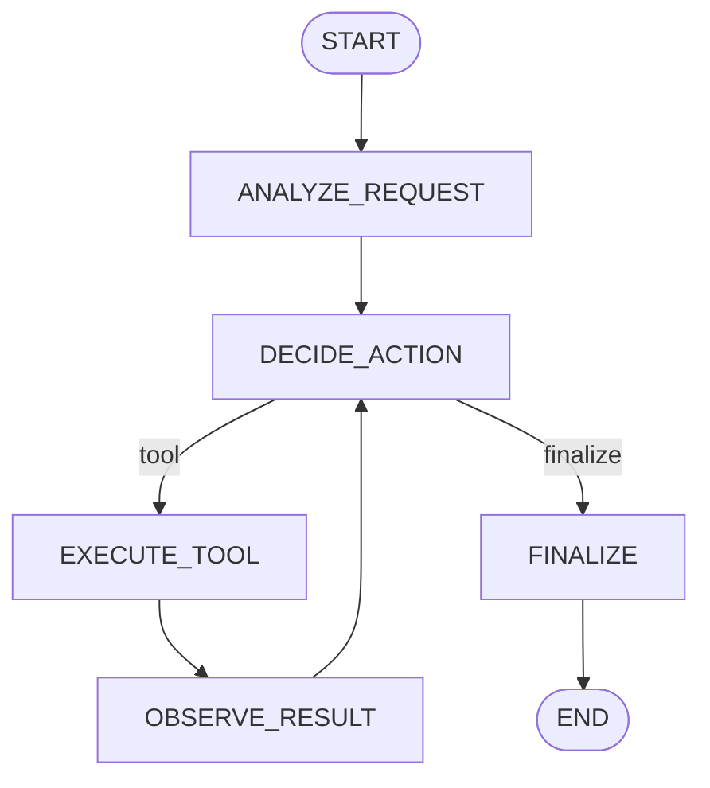

# LangGraph4j (Phase 8)

Explicit stateful graph orchestration for the WorkForge AI agent.

## 1. Why LangGraph4j

Phase 7 already has an LLM-driven decide → tool → observe loop in plain Java.
**LangGraph4j does not make the model smarter.** It gives an application-level
workflow: typed **state**, named **nodes**, **edges**, **conditional edges**, and
**loops**, so orchestration is visible and testable.

We use **LangGraph4j `1.8.26`** with **`langgraph4j-spring-ai`**, aligned to
**Spring AI `2.0.0`** (same BOM as this project).

## 2. State

`WorkforgeAgentState` extends `org.bsc.langgraph4j.state.AgentState`.

| Field | Role |
|-------|------|
| `userMessage` | Original request |
| `context` | Append-only observations |
| `toolCalls` / `toolResults` | Append-only tool audit |
| `steps` | Execution timeline (node + action) |
| `currentNode` | Last node name |
| `iteration` / `maxIterations` | Loop safety |
| `nextRoute` | `tool` or `finalize` (conditional edge) |
| `pendingTool` / `pendingArguments` | Selected tool for EXECUTE_TOOL |
| `lastObservation` | Latest tool output summary |
| `finalAnswer` / `completed` / `status` | Termination |

State is created **per invoke** — not a global mutable singleton.

## 3. Nodes

| Node | Responsibility |
|------|----------------|
| `ANALYZE_REQUEST` | Normalize request, seed context |
| `DECIDE_ACTION` | LLM chooses tool or final (JSON) |
| `EXECUTE_TOOL` | Run Phase 6 `WorkforgeTools` via ToolCallback |
| `OBSERVE_RESULT` | Append observation to context |
| `FINALIZE` | User-facing answer + completed flag |

## 4–5. Edges / conditional edges

```
START → ANALYZE_REQUEST → DECIDE_ACTION
                              │
              ┌───────────────┴───────────────┐
              │ nextRoute == tool             │ else
              ▼                               ▼
         EXECUTE_TOOL                     FINALIZE → END
              │
              ▼
         OBSERVE_RESULT → DECIDE_ACTION   (loop)
```

Conditional edge after `DECIDE_ACTION` maps:

- `tool` → `EXECUTE_TOOL`
- `finalize` → `FINALIZE`

## 6. Graph compilation

`WorkforgeAgentGraph` builds a `StateGraph`, wires nodes/edges, then `compile()`
into an immutable `CompiledGraph`.

## 7. Graph execution

`AgentGraphService` calls `compiledGraph.invoke(initialStateMap)` and maps the
final state to the API DTO.

## 8. Loops

`OBSERVE_RESULT → DECIDE_ACTION` is the explicit loop. Tool sequence is **not**
hardcoded per question; the decide node chooses the next tool from observations.

## 9. Iteration limits

- Config: `workforge.ai.graph-agent.max-iterations` (`AI_GRAPH_AGENT_MAX_ITERATIONS`, default 5)
- Request override: `maxIterations` (1–10)
- On limit: route to `FINALIZE`, status `MAX_ITERATIONS`, best available answer
- Compiled graph also has a hard node-visit ceiling

## 10. Tool integration

```
Graph Node (EXECUTE_TOOL)
  → Spring AI ToolCallback
  → WorkforgeTools (@Tool)
  → IssueToolService / ProjectToolService
  → Repository
  → PostgreSQL (workforge_ai sample tables)
```

Tools reused from Phase 6: `getIssue`, `searchIssues`, `getProject` (read-only).

## 11. Phase 7 Agent vs Phase 8 Graph Agent

| | Phase 7 Agent | Phase 8 Graph Agent |
|--|---------------|---------------------|
| API | `POST /api/v1/ai/agent/run` | `POST /api/v1/ai/graph-agent` |
| Orchestration | Custom Java loop in `AgentService` | LangGraph4j `StateGraph` |
| Structure | Implicit in code | Explicit nodes / edges / state schema |
| Same tools | Yes | Yes |
| Smarter LLM? | No | No — same model + tools |

**Agent:** LLM-driven decision loop.  
**LangGraph:** Explicit workflow/state orchestration around that agent.

## Mermaid



## Studio

[LangGraph4j Studio](https://github.com/langgraph4j/langgraph4j) can visualize graphs.
It is **optional** and not required for normal `graph-agent` execution in this app
(we do not embed Studio by default to keep the runtime stable).

## API example

```http
POST /api/v1/ai/graph-agent
{
  "message": "Tell me about MWS-1 and its project.",
  "maxIterations": 5
}
```

UI: http://localhost:5174/graph-agent
